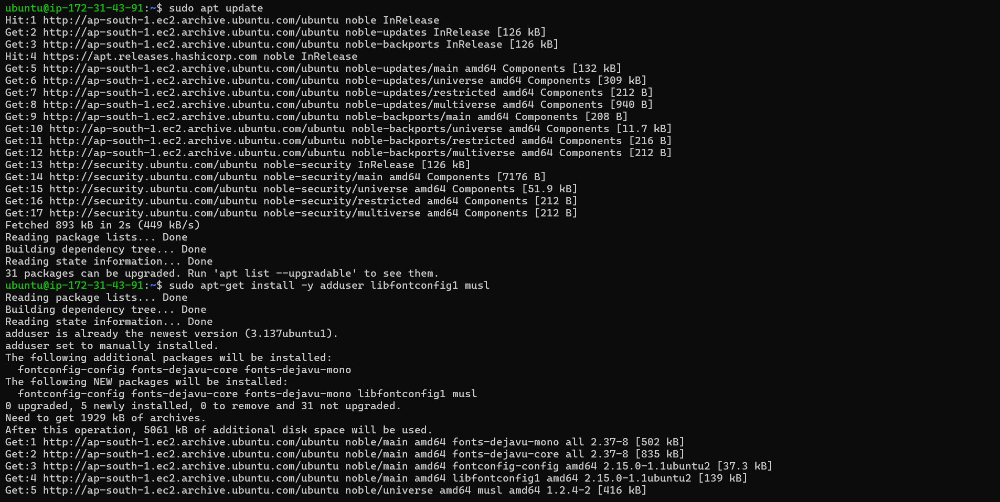
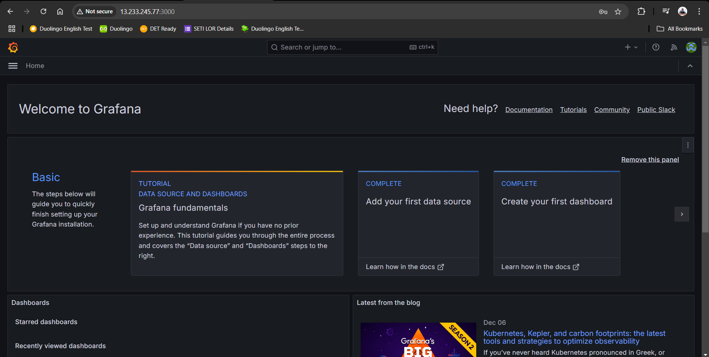

## Set of steps for this mini project:

## Steps to Set Up GitHub Monitoring with Grafana

### 1. **Launch an EC2 Instance**
   - Launch an EC2 instance on AWS.
   - Allow inbound traffic on port `3000` in the security group to access Grafana via a web browser.

### 2. **Install Grafana**
   - Download Grafana from the official website: [https://grafana.com/grafana/download](https://grafana.com/grafana/download).
   
   
   

   - Verify Grafana is running by opening `http://<public_ip>:3000` in your browser.
   

### 3. **Create a GitHub Personal Access Token (PAT)**
   - Log in to your GitHub account.
   - Go to **Settings** > **Developer settings** > **Personal access tokens**.
   - Generate a new token with the necessary scopes (e.g., `repo`, `read:org`).
   - Save the token securely, as it will be used to connect Grafana to GitHub.

### 4. **Add GitHub as a Data Source in Grafana**

### 5. **Import a GitHub Dashboard**
   - Visit [Grafana Dashboards](https://grafana.com/dashboards).
   - Search for a GitHub-related dashboard and copy its **Dashboard ID**.
   - In Grafana, go to **+ Create** > **Import**.
   - Paste the Dashboard ID and click **Load**.
   - Assign the previously created GitHub data source to the dashboard.
   - Click **Import** to add the dashboard.

### 6. **Monitor GitHub Data**
   - Open the imported dashboard in Grafana.
   - View real-time insights and metrics for your GitHub repositories and account activities.